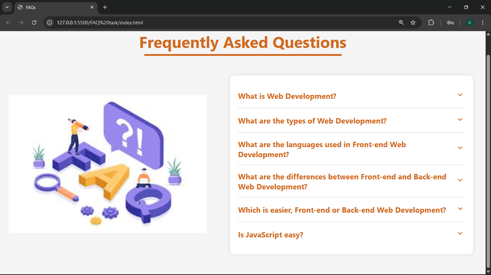

# Frequently Asked Questions

## Description
A simple Frequently Asked Questions website. With chevron icons to toggle the answers open and close when clicked on.  Built using HTML, CSS, and JavaScript.

## Features
- Toggle open and close answers
- Questions are already on display

## How to Run
1. Clone the repository
2. Open index.html in your browser

## Tech Stack
- HTML
- CSS
- JavaScript

